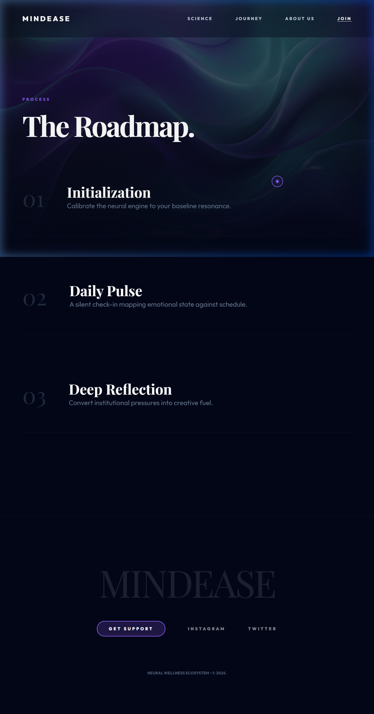
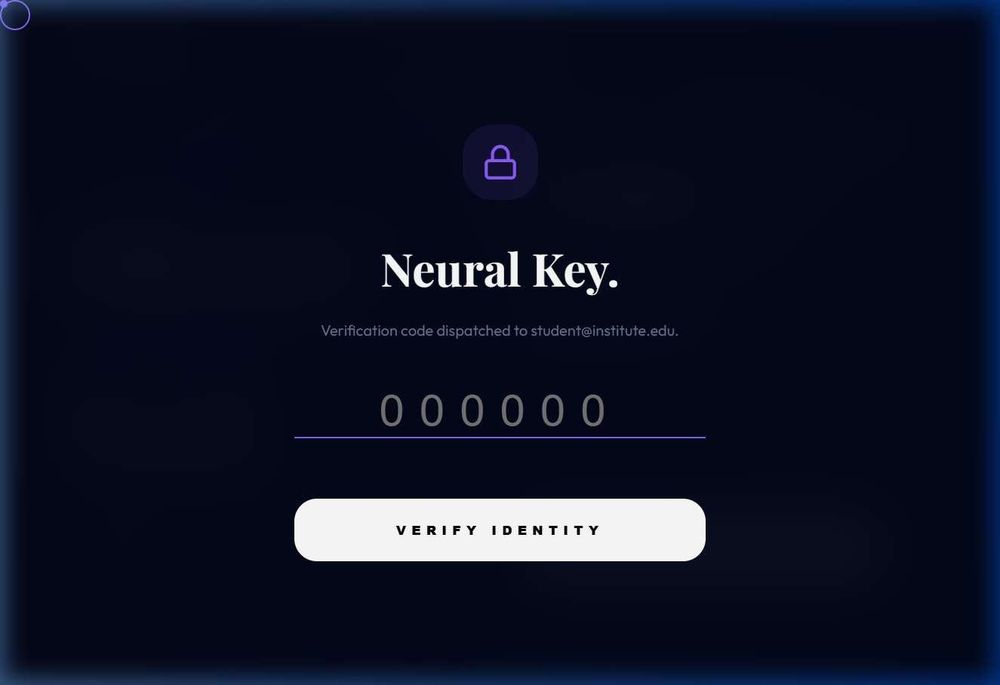
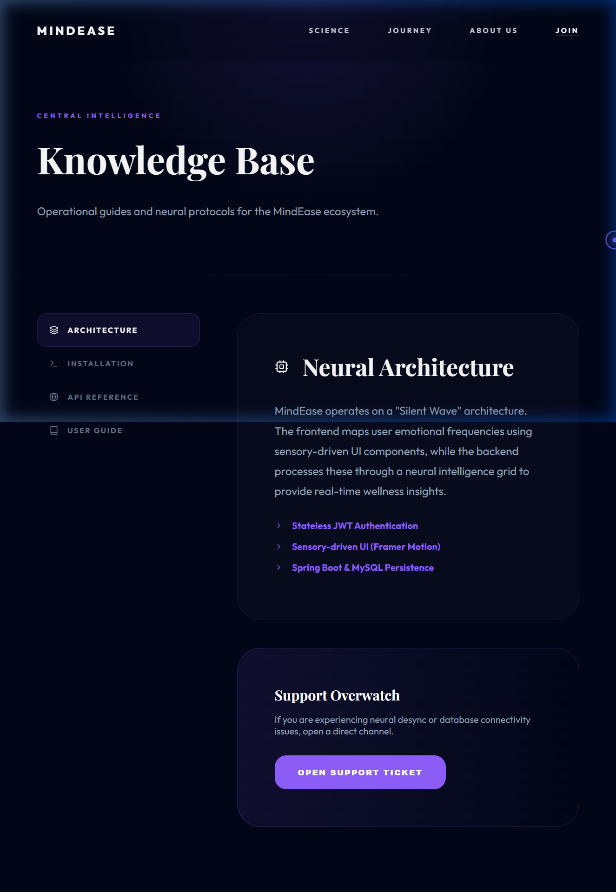

# 🧘‍♂️ MindEase: Institutional Wellness Ecosystem

**Silence of the Soul. Map your journey through the academic landscape.**

MindEase is a premium, sensory-driven wellness platform designed for academic institutions. It bridges the gap between student mental health and institutional overwatch through AI-driven resonance mapping, high-fidelity soundscapes, and decentralized security.

---

## ✨ Core Architecture

### 1. The Neural Interface (Landing)
A high-contrast, premium entry point designed to lower cognitive load upon arrival.


### 2. Institutional Overwatch (Security)
Dual-verification protocol ensuring only verified institutional identities can enter the grid. Includes a 6-digit Neural Key (OTP) handshake.


### 3. Knowledge Base (Support)
A centralized hub for documentation and institutional support channels.


---

## 🚀 Technical Stack

- **Frontend**: React 18, Vite, Framer Motion (Animations), Lucide (Icons)
- **Audio**: Procedural Web Audio API (Neural Pulse), Custom Soundscapes
- **Backend**: Spring Boot 3, Java 17, Spring Security
- **Intelligence**: AI-driven neural revelations and energy mapping

---

## 🛠️ Launch Instructions

### Prerequisites
- Node.js (v18+)
- Java JDK 17
- Maven

### 1. Initialize Backend
```bash
cd backend
./mvnw spring-boot:run
```

### 2. Initialize Frontend
```bash
cd frontend
npm install
npm run dev
```

### 3. Verification Key
For the demo initialization, use the universal Neural Key: `123456`

---

## 🔒 Security & Privacy
MindEase uses **Decentralized Encryption** for all student reflections. The institutional overwatch (Counselors/Admins) can monitor high-level campus pulse metrics without compromising individual student privacy.

---

**NEURAL WELLNESS ECOSYSTEM • © 2026.**
