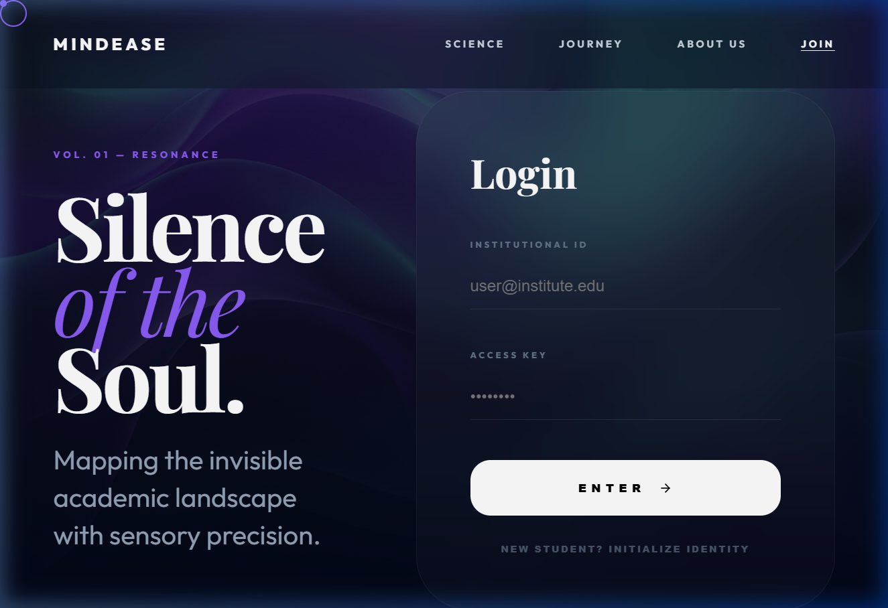
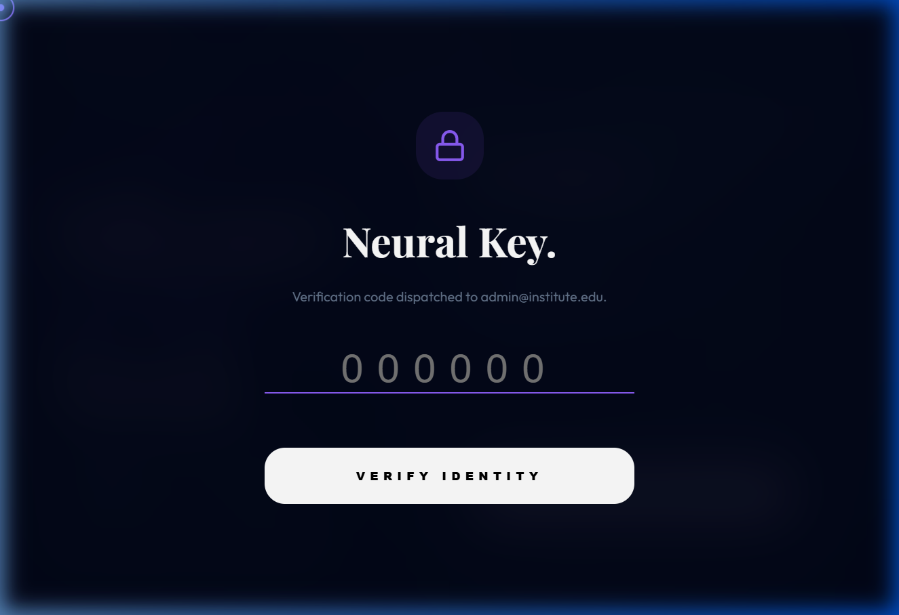
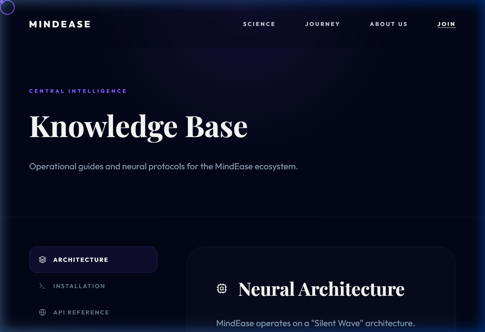

# ❖ MindEase | Institutional Wellness Ecosystem


MindEase is a premium, high-performance wellness management ecosystem designed for modern educational institutions. It features a stunning **Neural-Resonance UI**, AI-driven emotional mapping, institutional security overwatch, automated student support synchronization, and production-grade secure identity protocols.

---

## 🌐 Live Deployments

- **Frontend (Vercel)**: Live on Vercel Client (Auto-built on `main` push)
- **Backend (Render)**: [mindease-backend-4h6q.onrender.com](https://mindease-backend-4h6q.onrender.com/actuator/health) (Actuator health-check keeps container awake via UptimeRobot)
- **Database (Aiven)**: Hosted on a highly available Aiven Cloud MySQL instance

---

## 📷 Visual Preview

### 🏠 Home Page - Immersive Experience
The entry point to the neural grid, featuring high-fidelity animations and a "Silence of the Soul" design philosophy.


### 🔐 Security Hub - Neural Handshake
A professional 6-digit verification protocol (OTP) that ensures only verified institutional identities can access the platform.


### 📚 Knowledge Base - Institutional Support
A centralized hub where students can access resources, documentation, and create direct support tickets for campus counselors.


---

## 🧠 Core Architecture & Features

- **Google OAuth 2.0 Integration**: Single-click secure registration and login using institutional or personal Google accounts.
- **Real SMTP Email Verification**: Automatic dispatch of a 6-digit access OTP code using Spring Mail (`JavaMailSender`) on registration.
- **Uptime Monitoring**: Automated health checks pinging Spring Boot Actuator `/actuator/health` to guarantee 100% service availability.
- **Procedural Audio**: Real-time breathing guidance synthesized via the Web Audio API.
- **AI Insights**: Dynamic, personalized wellness insights powered by neural mapping (Groq API).
- **Institutional Overwatch**: A counselor-first portal for monitoring campus-wide wellness trends.
- **Persistent User Profile Configuration**: Real-time DB synchronization of custom user names and photo avatars. Image uploads are automatically compressed on the client-side (to ~40KB) via HTML5 Canvas before database write to optimize loading times.
- **Dynamic Session Metrics & API Safety**: Blocks dashboard AI calls and hides baseline stats until the calibration test is completed, safeguarding system integrity and API consumption.
- **Glassmorphic Design System**: Custom Vanilla CSS with deep blurs, animated borders, and modern typography.

---

## 🛠️ Environment Configuration

### Backend (`backend/src/main/resources/application.properties`)
The backend reads production keys dynamically from environment variables, falling back to local configurations for offline development:

```properties
# Database Connectivity
SPRING_DATASOURCE_URL=jdbc:mysql://<aiven-host>:<port>/defaultdb?useSSL=true&allowPublicKeyRetrieval=true
SPRING_DATASOURCE_USERNAME=avnadmin
SPRING_DATASOURCE_PASSWORD=<your-aiven-password>

# Google Sign-In (OAuth 2.0)
GOOGLE_CLIENT_ID=<your-google-client-id>

# SMTP Configuration (Gmail)
SMTP_EMAIL=kaustubhjadhav0043@gmail.com
SMTP_PASSWORD=<your-gmail-app-password>
```

### Frontend (`frontend/.env`)
Set these environment variables in Vercel or locally in a `.env` file:

```env
VITE_API_URL=https://mindease-backend-4h6q.onrender.com/api
VITE_GOOGLE_CLIENT_ID=383035276055-ommbuov3psbkolu5vm9gvv6te4hun6r4.apps.googleusercontent.com
VITE_GROQ_API_KEY=<your-groq-key>
```

---

## 🚀 Run Locally

### 1. Initialize Backend (Spring Boot)
Ensure your local MySQL server is active, then:
```bash
cd backend
./mvnw spring-boot:run
```

### 2. Initialize Frontend (Vite)
Install package dependencies and boot up the development server:
```bash
cd frontend
npm install
npm run dev
```

---

**NEURAL WELLNESS ECOSYSTEM • © 2026.**
